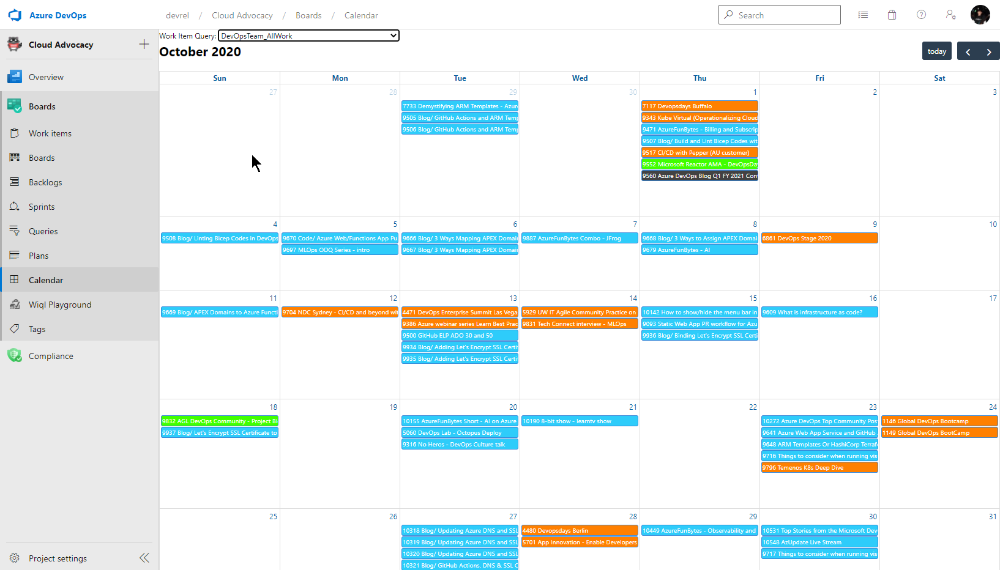

# WorkItem Calendar
All work the Cloud Advocates do are tracked in Azure DevOps. The kanban boards and backlogs are great at creating lists of work to do, prioritizing work, even tracking ongoing work. But there is no calendar view which shows when work items are due/published/started etc. on a calendar.

Pierre Roman from the Modern Infra team pinged me about needing a simple calendar in AzD to help them with scheduling for their blog. This was something we on the DevOps team also needed to help us schedule our Azure DevOps Blog. So, instead of freaking out about the election, I decided to write a quick and dirty extension

 

## Setup
This calendar is driven off of flat queries. Create a flat query that returns the work items you want to see and select it from the Work Item Query drop down.

## How it works
Work Items are driven off of the type of date saved. The way it prioritizes date values is it uses the first one in the list that's true:

- if work item has a ```Custom.PublishDate```, it will use this date
- if work item has a ```Microsoft.VSTS.Scheduling.StartDate```, it will use it. If it has a ```Custom.EndDate```, it will use that as the end date.
- if it has a ```Microsoft.VSTS.Scheduling.DueDate```, it will use it.
- if it has none of these, it won't show up in the calendar.

At this moment, the calendar only works if the fields ```Custom.PublishDate``` and ```Custom.EndDate``` exists. Add these two fields in, even if you don't use to get the cal working. I need to add code to see if those fields exist in the project, and if it doesn't don't add them to the wiql

## Bugs and Feature Requests
I coded this up FAST. So that means it has not been extensively tested and unfortunately, that means there's probably bugs in here. If you found bugs or have new feature reqeusts, add them here: 

 https://github.com/abelsquidhead/AzDCalendar/issues

 If you want to help contribute features, here is repo:

 https://github.com/abelsquidhead/AzDCalendar
